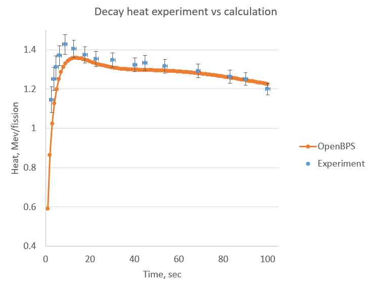

.. _nfp:

==================
Neutron Fast Pulse
==================

The first test is the simple fission decay heat modelling. This test based on
experiment of deacay heat measurements after short thermal neutrons pulse on 
samples with uranium-235. The calculatation will be conducted through two
steps with external neutron field (short pulse during 1.0 sec) and without it
(during 'cooling time' 100 sec).
First of all we need to prepare :ref:`configure_xml` input file. To get result 
as faster as we can let's use a ``chebyshev`` :ref:`method <chebyshev_method>` 
with 16th order for 1.0 second (description in sections ``<timestep>`` and 
``<timerecord>`` are equal in this example) for 10 calculation steps.

.. code-block:: xml

    <configure>
      <chain>./examples/chain_endfb71.xml</chain>
      <nuclides>./examples/nuclides.xml</nuclides>
      <impxslibs>
        <impxslib>./examples/XMAS172.xml</impxslib>
      </impxslibs>
      <inpmaterials>./examples/U235thn_1sec/materialsi.xml</inpmaterials>
      <reaction>./examples/U235thn_1sec/reactions.xml</reaction>
      <outmaterials>./examples/U235thn_1sec/materialso.xml</outmaterials>
      <filters>
        <filter type="exnuclide">U238 U239 U235 Pu238 Pu239 Pu240 Pu241 Pu242 Am241 Am242_m1</filter>
      </filters>
      <numbers>10</numbers>
      <timestep>1</timestep>
      <!-- IT IS  equivalent time description
      timerecord year="0" month="0" day="0.0" hour="0" minute="0" second="1"/-->
      <method>chebyshev</method>  
      <epb>1.e-3</epb>
      <decaykey>false</decaykey>
      <uncertanties>false</uncertanties>
      <decay_print>false</decay_print>
      <cram_order>16</cram_order>
    </configure>

We made references to path with chain file based on nuclear data library 
endfb_; to path with imported cross-section ``XMAS172`` with 172 
energy multigroup cross-sections library. :ref:`materials` description is quite
simple for the test.

.. code-block:: xml

    <materials>
      <material name="u235" volume="1.0" mass="1.0" power="1.0">
        <namenuclides>U235</namenuclides>
        <conc>1.00000</conc>
      </material>
    </materials>

As first calculation are provided under neutron external source we need a
:ref:`reactions_xml` file:

.. code-block:: xml

    <compositions>
      <composit name="u235">
        <energy ng="4">0.0252 2.15 1000.0 800000.0 20000000.0</energy>
        <energy ng="1">0.0252 20000000.0</energy>
        <xslibs ng="1" typex="rxs">
          <xslib name="U235" ng="1" reaction="fission">1.7528e+16</xslib>
          <xslib name="Pu239" ng="1" reaction="fission">2.9496e+15</xslib>
        </xslibs>
        <flux ng="4">1.0 0.0 0.0 0.0</flux>
        <dflux ng="4">0.1 0.0 0.0 0.0</dflux>
      </composit>
    </compositions>

**Note:** It is very important that name of ``composit`` should be match with
          name of according ``material``.

To right calculation of neutron fission product yields it is important to 
describe a flux. It is sufficient one value to according energy:

.. code-block:: xml

    <energy ng="4">0.0252 2.15 1000.0 800000.0 20000000.0</energy>
    <flux ng="4">1.0 0.0 0.0 0.0</flux>

After successfull calculation of the first part of the test we just need
to modify our :ref:`configure_xml`. The key ``<decaykey>`` should be switched on
to perform simulation without external field, meantime the :ref:`key <keys>`
``<decay_print>`` should be switched on too for decay heat values printing.
Then we need to change time and step numbers parametres:

.. code-block:: xml
 
      <numbers>100</numbers>
      <timestep>100</timestep>
      <inpmaterials>./examples/U235thn_1sec/materialso.xml</inpmaterials>

Input materials file name should be equal to name of output materials file from
the first part of calculation. As we calculate decay heat from the fission 
products we must exclude actinides using :ref:`filters <filter_xml>` section:

.. code-block:: xml
 
      <filters>
        <filter type="exnuclide">U238 U239 U235 Pu238 Pu239 Pu240 Pu241 Pu242 Am241 Am242_m1</filter>
      </filters>

Finally we get ``outlog.csv`` file.

.. csv-table:: **The results of calculation**
   :header: "dt","Act, sec-1","Q, Mev","dAct, sec-1","dQ, Mev"
   :widths: 3, 10, 10, 10, 10

   "u235", "", "", "", ""
    1,2.87807e+15,1.0377e+16,8.88746e+13,3.0786e+14
    2,2.18948e+15,7.60349e+15,6.96329e+13,2.30963e+14
    3,1.77375e+15,6.00587e+15,5.71852e+13,1.84742e+14
    4,1.49139e+15,4.95996e+15,4.81608e+13,1.528e+14
    5,1.28575e+15,4.21881e+15,4.12684e+13,1.29225e+14
    6,1.12879e+15,3.66398e+15,3.58373e+13,1.11111e+14
    7,1.00485e+15,3.23177e+15,3.14602e+13,9.67793e+13
    8,9.04417e+14,2.88495e+15,2.7868e+13,8.51753e+13
    9,8.21365e+14,2.60027e+15,2.48749e+13,7.55998e+13
    10,7.51538e+14,2.36238e+15,2.23482e+13,6.75728e+13
    11,6.92016e+14,2.16071e+15,2.01911e+13,6.07554e+13
    12,6.40687e+14,1.9877e+15,1.83316e+13,5.49021e+13
    13,5.95986e+14,1.83782e+15,1.67154e+13,4.98311e+13
    14,5.56726e+14,1.70689e+15,1.53006e+13,4.54051e+13
    15,5.21993e+14,1.5917e+15,1.40545e+13,4.1518e+13
    16,4.91069e+14,1.48973e+15,1.29514e+13,3.80868e+13
    17,4.63382e+14,1.39898e+15,1.19704e+13,3.50447e+13
    18,4.38472e+14,1.31782e+15,1.10946e+13,3.23376e+13
    19,4.1596e+14,1.24493e+15,1.03102e+13,2.9921e+13
    20,3.95534e+14,1.1792e+15,9.60538e+12,2.77577e+13
    21,3.76935e+14,1.11972e+15,8.97047e+12,2.58161e+13
    22,3.59942e+14,1.06571e+15,8.39711e+12,2.40696e+13
    23,3.44367e+14,1.0165e+15,7.87816e+12,2.24952e+13
    24,3.30052e+14,9.71539e+14,7.40749e+12,2.10731e+13
    25,3.16857e+14,9.30334e+14,6.97974e+12,1.9786e+13
    26,3.04664e+14,8.92467e+14,6.59028e+12,1.8619e+13
    27,2.93369e+14,8.57574e+14,6.23501e+12,1.75588e+13
    28,2.8288e+14,8.25336e+14,5.91035e+12,1.6594e+13
    29,2.73117e+14,7.95476e+14,5.61316e+12,1.57144e+13
    30,2.64011e+14,7.67751e+14,5.34064e+12,1.4911e+13
    31,2.555e+14,7.41947e+14,5.09031e+12,1.41758e+13
    32,2.47528e+14,7.17874e+14,4.85999e+12,1.3502e+13
    33,2.40046e+14,6.95367e+14,4.6477e+12,1.28832e+13
    34,2.33012e+14,6.74278e+14,4.45173e+12,1.2314e+13
    35,2.26386e+14,6.54476e+14,4.27051e+12,1.17893e+13
    36,2.20133e+14,6.35844e+14,4.10265e+12,1.13049e+13
    37,2.14224e+14,6.1828e+14,3.94692e+12,1.08569e+13
    38,2.08629e+14,6.01692e+14,3.80219e+12,1.04418e+13
    39,2.03324e+14,5.85996e+14,3.66748e+12,1.00564e+13
    40,1.98286e+14,5.71118e+14,3.54189e+12,9.69806e+12
    41,1.93495e+14,5.56994e+14,3.42461e+12,9.36423e+12
    42,1.88932e+14,5.43562e+14,3.31492e+12,9.0527e+12
    43,1.84581e+14,5.30771e+14,3.21217e+12,8.76147e+12
    44,1.80427e+14,5.18571e+14,3.11576e+12,8.48877e+12
    45,1.76456e+14,5.06919e+14,3.02516e+12,8.23297e+12
    46,1.72656e+14,4.95776e+14,2.9399e+12,7.99263e+12
    47,1.69015e+14,4.85106e+14,2.85955e+12,7.76645e+12
    48,1.65523e+14,4.74876e+14,2.7837e+12,7.55325e+12
    49,1.6217e+14,4.65058e+14,2.712e+12,7.35198e+12
    50,1.58948e+14,4.55625e+14,2.64414e+12,7.16166e+12
    51,1.55849e+14,4.46552e+14,2.57981e+12,6.98144e+12
    52,1.52865e+14,4.37816e+14,2.51875e+12,6.81054e+12
    53,1.4999e+14,4.29399e+14,2.46071e+12,6.64823e+12
    54,1.47217e+14,4.2128e+14,2.40548e+12,6.49388e+12
    55,1.44541e+14,4.13442e+14,2.35286e+12,6.34689e+12
    56,1.41957e+14,4.05871e+14,2.30265e+12,6.20674e+12
    57,1.39459e+14,3.98551e+14,2.2547e+12,6.07294e+12
    58,1.37044e+14,3.91468e+14,2.20885e+12,5.94504e+12
    59,1.34707e+14,3.84612e+14,2.16496e+12,5.82265e+12
    60,1.32443e+14,3.77969e+14,2.1229e+12,5.70539e+12
    61,1.3025e+14,3.71529e+14,2.08255e+12,5.59293e+12
    62,1.28124e+14,3.65283e+14,2.04381e+12,5.48495e+12
    63,1.26062e+14,3.59221e+14,2.00656e+12,5.38118e+12
    64,1.24061e+14,3.53335e+14,1.97074e+12,5.28135e+12
    65,1.22119e+14,3.47617e+14,1.93624e+12,5.18522e+12
    66,1.20231e+14,3.42058e+14,1.90299e+12,5.09258e+12
    67,1.18397e+14,3.36653e+14,1.87091e+12,5.00322e+12
    68,1.16614e+14,3.31395e+14,1.83995e+12,4.91696e+12
    69,1.1488e+14,3.26277e+14,1.81005e+12,4.83361e+12
    70,1.13193e+14,3.21295e+14,1.78113e+12,4.75303e+12
    71,1.1155e+14,3.16441e+14,1.75316e+12,4.67507e+12
    72,1.09951e+14,3.11712e+14,1.72608e+12,4.59959e+12
    73,1.08393e+14,3.07102e+14,1.69984e+12,4.52645e+12
    74,1.06874e+14,3.02608e+14,1.67441e+12,4.45556e+12
    75,1.05395e+14,2.98224e+14,1.64975e+12,4.38678e+12
    76,1.03952e+14,2.93946e+14,1.62581e+12,4.32003e+12
    77,1.02544e+14,2.89772e+14,1.60257e+12,4.25521e+12
    78,1.01171e+14,2.85696e+14,1.57999e+12,4.19223e+12
    79,9.98308e+13,2.81716e+14,1.55804e+12,4.131e+12
    80,9.85226e+13,2.77829e+14,1.5367e+12,4.07145e+12
    81,9.72451e+13,2.74031e+14,1.51594e+12,4.01351e+12
    82,9.59974e+13,2.70319e+14,1.49573e+12,3.9571e+12
    83,9.47783e+13,2.6669e+14,1.47605e+12,3.90217e+12
    84,9.35871e+13,2.63143e+14,1.45688e+12,3.84865e+12
    85,9.24227e+13,2.59673e+14,1.43819e+12,3.79649e+12
    86,9.12843e+13,2.56279e+14,1.41998e+12,3.74564e+12
    87,9.01711e+13,2.52958e+14,1.40221e+12,3.69604e+12
    88,8.90822e+13,2.49709e+14,1.38488e+12,3.64764e+12
    89,8.8017e+13,2.46528e+14,1.36797e+12,3.60041e+12
    90,8.69746e+13,2.43415e+14,1.35146e+12,3.55429e+12
    91,8.59544e+13,2.40366e+14,1.33533e+12,3.50925e+12
    92,8.49557e+13,2.3738e+14,1.31958e+12,3.46526e+12
    93,8.39779e+13,2.34455e+14,1.30419e+12,3.42226e+12
    94,8.30203e+13,2.3159e+14,1.28915e+12,3.38024e+12
    95,8.20824e+13,2.28782e+14,1.27444e+12,3.33916e+12
    96,8.11635e+13,2.26031e+14,1.26006e+12,3.29898e+12
    97,8.02633e+13,2.23334e+14,1.24599e+12,3.25968e+12
    98,7.9381e+13,2.2069e+14,1.23222e+12,3.22123e+12
    99,7.85162e+13,2.18098e+14,1.21875e+12,3.1836e+12
    100,7.76685e+13,2.15556e+14,1.20557e+12,3.14677e+12

------------------
Results proceeding
------------------

This test are based on experiment to decay head measurement conducted by [Dickens]_
ORNL. We can compare our results with experiment. Let us consider new function ``F``
are defined as follows:

.. math::
    :label: example1

    F = \frac{Q*t}{R_{fission}};

where ``Q`` is our decay heat (Mev); ``t`` is a current time and 
R\ :sub:`fission`\ is a number of fissions during 1.0 sec pulse, it means 
just a reaction-rate values for U235 from ``reactions.xml``. Given results are
presented on the next graph:

.. _figure-decay-graph:

    Total decay heat from thermal pulse on U235.

As you can see in :ref:`figure-decay-graph` our calculation result has a good 
agreement with experimental data especially after of 20 sec of the cooling time.

.. only:: html

   .. rubric:: References

.. [Dickens]  J. K. Dickens, J. F. Emery, T. A. Love, J. W. McConnell
   ,K.J.Northcutt ,R. W. Peelle, and H. Weaver, “Fission Product Energy Release 
   for Times Following Thermal-Neutron Fission of U235 Between 2 and 14000
   Seconds,” Tech. Rep. ORNL/NUREG-14, Oak Ridge National Laboratory, 1979.

.. _endfb: https://www.nndc.bnl.gov/endf/b7.1/

    
